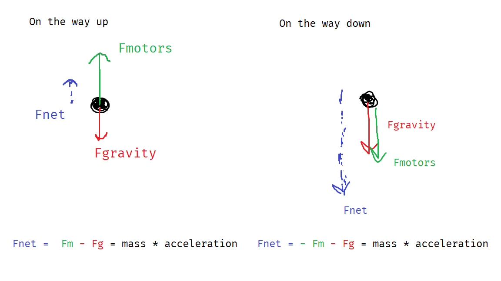
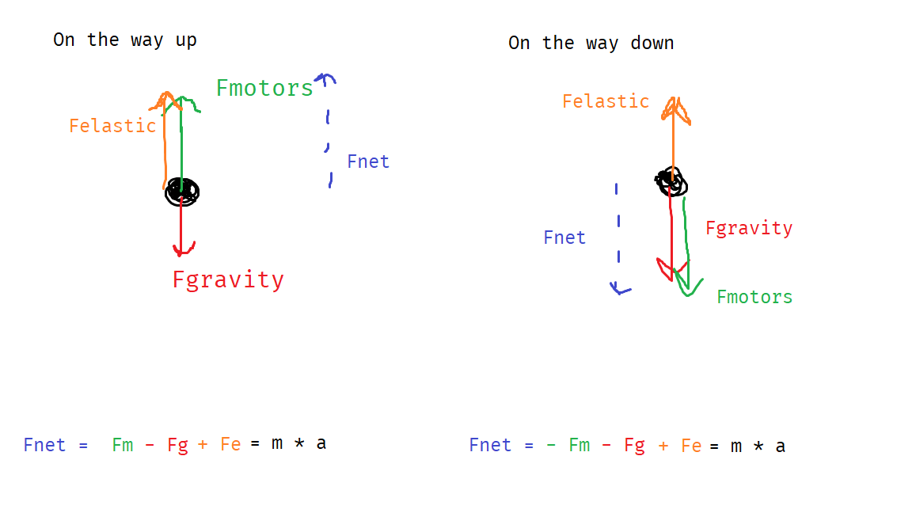

# Elastics

Motors are only half the story.

Elastics are **essential** on systems that move against gravity. Consider the difference between a the forces on a lift on the way up, and on the way down.



These are *free body diagrams*. They represent all the forces acting on the lift, as if they were all acting on a point.

`Fnet` stands for *net force*, or the overall sum of the forces. According to *Newton's Second Law*:
```
Fnet = mass * acceleration
```
From this equation, the lower `Fnet` is, the less acceleratios, AKA the lift isn't as responsive and fast.

Now, in  the upward direction, Fnet is smaller (gravity fights the motors), so acceleration is smaller. In the downward direction, Fnet is larger (gravity assists the motors) so acceleration is larger.

This makes sense: on the way down, the lift falls, but on the way up, it 'fights gravity'.

This is a problem. There is a huge imbalance between the upward and downward motion of the lift. This is why we need elastics!

See the elastic case:



Notice how the elastic force counteracts gravity, so `Fnet` doesn't change as much when the lift changes from going upward to downward.

