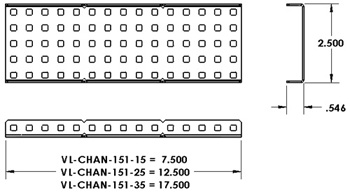

# Mechanical VEX Robotics

This content pertains to the mechanical design and assembly of VEX robots.

# Refining Building Skill

An important part of making competition-level robots is reducing the possible room for error, looseness, etc... that results simply from building without the level of scrutiny that is necessary.

### What is 'Slop'?

'Slop' refers to building 'sloppily' - which could mean one or several of the following, for example:
- spacing between parts is not exact
- don't even know the right number of holes to use
- gears don't mesh with eachother perfectly
- connection is easily twisted apart
etc...

The key to reducing slop is to eliminate it's sources, one by one. Here are some common sources of slop, along with ways to fix them.

### 1. Know the Spacing

Knowing how much space should be in between parts is essential. Every length, dimension, and even weight is recorded, and for you to use. You can determine the exact lengths of parts [on the VEX site](https://www.vexrobotics.com/shafts-and-hardware.html) (see the size tab at the bottom), using a ruler, or by using [CAD](cad.md).

> 'OD and ID' stand for 'Outside Diameter' and Inside Diameter' respectively.

You should also know some basic facts about how VEX distances correlate in real life:

- Holes happen to be exactly 0.5" apart from hole to hole in a straight line.
- The VRC max size limit is usually 18", so a 7-segment (35-hole) C-channel is 0.5" from being the max edge length.
- Screws are NOT exactly the right radius to fit inside the C channel squares. They are a bit smaller, which allows you to shift the metal a bit in a joint (which leads to less exactness.)
