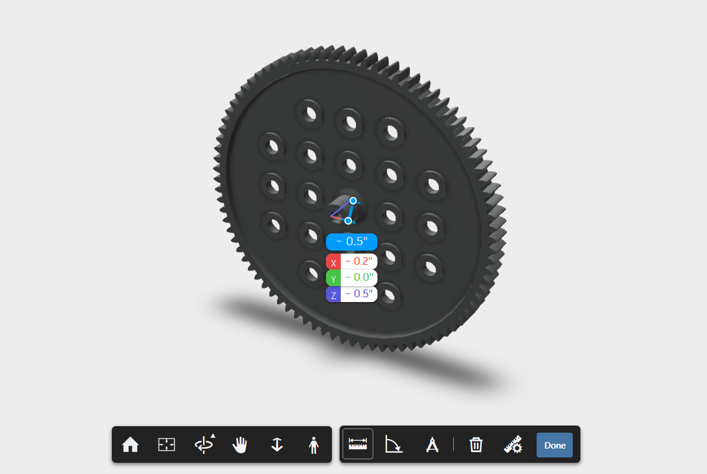
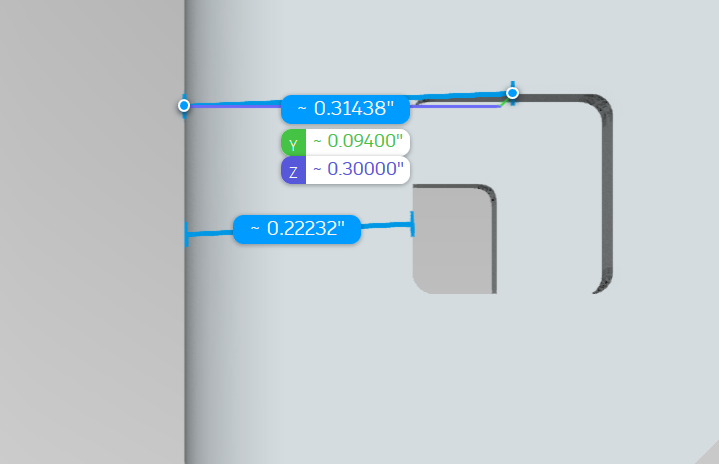

# Mechanical VEX Robotics

This content pertains to the mechanical design and assembly of VEX robots.

# Refining Building Skill

An important part of making competition-level robots is reducing the possible room for error, looseness, etc... that results simply from building without the level of scrutiny that is necessary.

### What is 'Slop'?

'Slop' refers to building 'sloppily' - which could mean one or several of the following, for example:
- spacing between parts is not exact
- don't even know the right number of holes to use
- gears don't mesh with eachother perfectly
- connection is easily twisted apart
etc...

The key to reducing slop is to eliminate it's sources, one by one. Here are some common sources of slop, along with ways to fix them.

### 1. Know thy Spacing

Knowing how much space should be in between parts is essential. Every length, dimension, and even weight is recorded, and for you to use. You can determine the exact lengths of parts [on the VEX site](https://www.vexrobotics.com/shafts-and-hardware.html) (see the size tab at the bottom), using a ruler, or by using [CAD](cad.md).

> 'OD and ID' stand for 'Outside Diameter' and Inside Diameter' respectively.

You should also know some basic facts about how VEX distances correlate in real life:


- Holes happen to be exactly 0.5" apart from hole to hole in a straight line.
- The VRC max size limit is usually 18", so a 7-segment (35-hole) C-channel is 0.5" from being the max edge length.
- Screws are NOT exactly the right radius to fit inside the C channel squares. They are a bit smaller, which allows you to shift the metal a bit in a joint (which leads to less exactness.) Except for [shoulder screws](https://www.vexrobotics.com/all-screws.html) which do.
- C channel side-panels are NOT 0.5" exactly (see above). This implies things about how C Channels line up.

As you practice building in VEX, you will see that spacing exactness will determine how professional and how clean your robot 'feels'. Tight, exact, planned spacing is key.

Let's show a very simple scenario where you will need to calculate spacing: gears.

In a simple scenario, perhaps we want  to find what spacing should be used to space out two 84-tooth gears on some axles.

To start, you need to find the lengths you already know. For this, I used some measurements on an online CAD viewer. You can see instructions on how to do this [in the CAD section](cad.md).

the gear width:

The width the gear takes up - 0.50"

the C channel hole spacing: 

(the distance from the center of the C channel hole to the inside edge) - 0.30"

Now, it is easiest if you can space out one side of both gears with a simple spacer (e.g. 0.25" spacer in this scenario would be appropriate.).

Now, the remainins space on this axle just needs to be calculated. This problem is solved for you already, you can use a [spacing calculator for VEX.](https://canyonturtle.github.io/spacing-calc)

Now the distance can be calculated: 

```
Remaining Spacing = Total distance - Gear width - 0.25" spacer
A = D - B - C
A = (2 - 2(0.3)) - 0.5 - 0.25
A = 2 - 1.35
A = 0.65"
```

Let's allow 0.05" of tolerance, and that is a final distance of 0.6" to fill with more spacers.

This example illustrates the monkeying around you have to do yourself to find the lengths precisely - but it CAN be done! the reward is perfect spacing, and no slop.